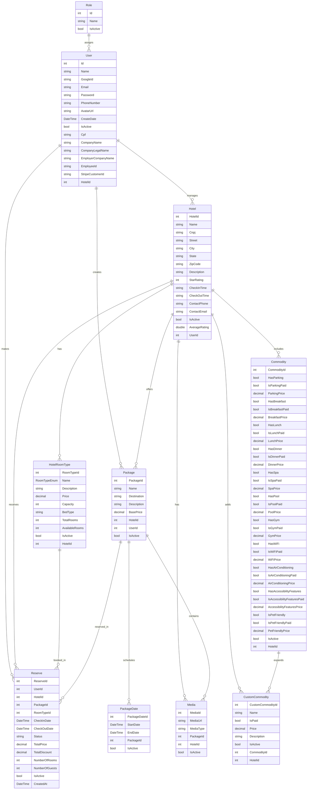

# 🌍 Viaggia - Sistema de Gerenciamento de Pacotes de Viagem

Este repositório contém o **back-end** do sistema **Viaggia**, desenvolvido com **ASP.NET Core 8**, utilizando o **Entity Framework Core**, autenticação com JWT, integração com APIs externas, e arquitetura limpa baseada em **camadas**.

## Tecnologias Utilizadas

- [.NET 8 (ASP.NET Core Web API)](https://learn.microsoft.com/en-us/aspnet/core/?view=aspnetcore-8.0)
- [Entity Framework Core (SQL Server)](https://learn.microsoft.com/en-us/ef/core/)
- [JWT (Json Web Token)](https://jwt.io/)
- [Swashbuckle (Swagger)](https://github.com/domaindrivendev/Swashbuckle.AspNetCore)
- [APIs externas](https://) (Google Maps, Stripe para pagamentos e Google SMTP para envio de e-mails e resete de senhas)

---

## 📁 Estrutura de Pastas
```
/viaggia_server
│
├── Controllers/         # Endpoints das APIs
├── Services/            # Lógica de negócio
├── Repositories/        # Acesso ao banco (repositórios + interfaces)
├── Models/              # Entidades principais
├── DTOs/                # Objetos de transferência de dados
├── Data/                # DbContext
├── EmailTemplates/      # Templates HTML dos e-mails enviados
├── wwwroot/             # Arquivos estáticos (ex: imagens)
│
├── Program.cs           # Entrada da aplicação
├── appsettings.json     # Configurações do projeto
```

---

### Modelo do Banco de Dados


---
### Como Executar Localmente

### ✅ Pré-requisitos

- [.NET 8 SDK](https://dotnet.microsoft.com/en-us/download)
- [SQL Server](https://www.microsoft.com/pt-br/sql-server/sql-server-downloads)
- [Visual Studio 2022 ou superior](https://visualstudio.microsoft.com/pt-br/)

### ⚙️ Passo a Passo

1. **Clone o repositório**
   ```bash
   git clone https://github.com/seu-usuario/seu-repositorio.git
   cd Viaggia.Backend
   ```

2. **Configure o banco de dados**
   - Crie um banco de dados no SQL Server com o nome `ViaggiaDb` (ou o nome que preferir).
   - Altere a connection string em `Viaggia.API/appsettings.Development.json`:
     ```json
     "ConnectionStrings": {
       "DefaultConnection": "Server=localhost;Database=ViaggiaDb;User Id=sa;Password=SuaSenhaForte;"
     }
     ```

3. **Restaure os pacotes e compile o projeto**
   ```bash
   dotnet restore
   dotnet build
   ```

4. **Aplique as migrações (se houver)**
   ```bash
   dotnet ef database update --project Viaggia.Infrastructure --startup-project Viaggia.API
   ```

5. **Execute a aplicação**
   ```bash
   dotnet run --project Viaggia.API
   ```

6. **Acesse no navegador**
   - A API estará disponível em: `https://localhost:5001` ou `http://localhost:5000`

7. **Testar via Swagger**
   - Acesse: `https://localhost:5001/swagger/index.html`

### 🧪 Rodar os testes

```bash
dotnet test Viaggia.Tests
```
---


