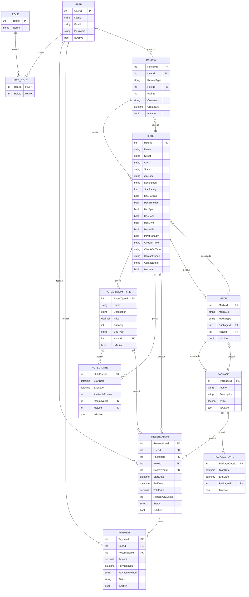

# 🌍 Viaggia - Sistema de Gerenciamento de Pacotes de Viagem

Este repositório contém o **back-end** do sistema **Viaggia**, desenvolvido com **ASP.NET Core 8**, utilizando o **Entity Framework Core**, autenticação com JWT, integração com APIs externas, e arquitetura limpa baseada em **camadas**.

## Tecnologias Utilizadas

- [.NET 8 (ASP.NET Core Web API)](https://learn.microsoft.com/en-us/aspnet/core/?view=aspnetcore-8.0)
- [Entity Framework Core (SQL Server)](https://learn.microsoft.com/en-us/ef/core/)
- [JWT (Json Web Token)](https://jwt.io/)
- [Swashbuckle (Swagger)](https://github.com/domaindrivendev/Swashbuckle.AspNetCore)
- [APIs externas](https://) (localização, pagamentos e validação de login)

---

## 📁 Estrutura de Pastas
```
/viaggia_server
│
├── Controllers/                 # APIs expostas (camada de entrada)
│   ├── HotelsController.cs      # Controlador para hotéis
│   ├── ReviewsController.cs     # Controlador para avaliações
│   ├── UsersController.cs       # Controlador para usuários
│   ├── PackagesController.cs    # Controlador para pacotes
│
├── Services/                    # Lógica de negócio (camada de serviço)
│   ├── Hotels/
│   │   ├── IHotelService.cs     # Interface do serviço de hotéis
│   │   ├── HotelService.cs      # Implementação do serviço de hotéis
│   ├── Reviews/
│   │   ├── IReviewService.cs    # Interface do serviço de avaliações
│   │   ├── ReviewService.cs     # Implementação do serviço de avaliações
│   ├── Users/
│   │   ├── IUserService.cs      # Interface do serviço de usuários
│   │   ├── UserService.cs       # Implementação do serviço de usuários
│
├── Repositories/                # Acesso ao banco de dados
│   ├── IRepository.cs           # Interface genérica do repositório
│   ├── Repository.cs            # Implementação genérica do repositório
│   ├── Hotels/
│   │   ├── IHotelRepository.cs  # Interface do repositório de hotéis
│   │   ├── HotelRepository.cs   # Implementação do repositório de hotéis
│   ├── Reviews/
│   │   ├── IReviewRepository.cs # Interface do repositório de avaliações
│   │   ├── ReviewRepository.cs  # Implementação do repositório de avaliações
│   ├── Users/
│   │   ├── IUserRepository.cs   # Interface do repositório de usuários
│   │   ├── UserRepository.cs    # Implementação do repositório de usuários
│   ├── Packages/
│   │   ├── IPackageRepository.cs # Interface do repositório de pacotes
│   │   ├── PackageRepository.cs  # Implementação do repositório de pacotes
│
├── Models/                      # Entidades principais que refletem o banco
│   ├── ISoftDeletable.cs        # Interface para exclusão lógica
│   ├── Hotels/
│   │   ├── Hotel.cs             # Modelo de hotel
|   |   ├── HotelRoomType.cs     # Modelo de tipo de quarto
|   |   ├── HotelDate.cs         # Modelo de datas de disponibilidade
│   ├── Packages/
│   │   ├── Package.cs           # Modelo de pacote
│   │   ├── PackageDate.cs       # Modelo de datas do pacote
│   ├── Medias/
│   │   ├── Media.cs             # Modelo de mídia
│   ├── Reservations/
│   │   ├── Reservation.cs       # Modelo de reserva
│   ├── Payments/
│   │   ├── Payment.cs           # Modelo de pagamento
│   ├── Reviews/
│   │   ├── Review.cs            # Modelo de avaliação
│   ├── Users/
│   │   ├── User.cs              # Modelo de usuário
│   │   ├── Role.cs              # Modelo de papel
│   │   ├── UserRole.cs          # Modelo de relação usuário-papel
│
├── DTOs/                        # Objetos de transferência de dados
│   ├── ApiResponse.cs           # Resposta padrão da API
│   ├── Hotels/
│   │   ├── HotelDTO.cs          # DTO para leitura de hotéis
│   │   ├── CreateHotelDTO.cs    # DTO para criação de hotéis
│   │   ├── HotelRoomTypeDTO.cs  # DTO para tipo de quarto
│   │   ├── HotelDateDTO.cs      # DTO para datas de disponibilidade
│   ├── Reviews/
│   │   ├── ReviewDTO.cs         # DTO para leitura de avaliações
│   │   ├── CreateReviewDTO.cs   # DTO para criação de avaliações
│   ├── Users/
│   │   ├── UserDTO.cs           # DTO para leitura de usuários
│   │   ├── CreateClientDTO.cs   # DTO para criação de clientes
│   │   ├── CreateServiceProviderDTO.cs # DTO para criação de prestadores de serviço
│   │   ├── CreateAttendantDTO.cs # DTO para criação de atendentes
│   ├── Packages/
│   │   ├── PackageDTO.cs        # DTO para leitura de pacotes
│   │   ├── PackageCreateDTO.cs  # DTO para criação de pacotes
│   │   ├── PackageUpdateDTO.cs  # DTO para atualização de pacotes
│   │   ├── PackageDateDTO.cs    # DTO para datas de pacotes
│   │   ├── MediaDTO.cs          # DTO para mídia
│
├── Data/                        # DbContext
│   ├── AppDbContext.cs          # Contexto do banco de dados
│
├── wwwroot/                     # Arquivos estáticos (ex.: imagens)
│   ├── Uploads/
│   │   ├── Hotels/              # Mídias de hotéis
|   |   ├── Pacotes/             # Mídias de pactoes
│
├── Program.cs                   # Ponto de entrada da aplicação
├── appsettings.json             # Configurações gerais do projeto
├── appsettings.Development.json # Configurações específicas para desenvolvimento
```

---

### Modelo do Banco de Dados


---
### Como Executar Localmente

### ✅ Pré-requisitos

- [.NET 8 SDK](https://dotnet.microsoft.com/en-us/download)
- [SQL Server](https://www.microsoft.com/pt-br/sql-server/sql-server-downloads)
- [Visual Studio 2022 ou superior](https://visualstudio.microsoft.com/pt-br/)

### ⚙️ Passo a Passo

1. **Clone o repositório**
   ```bash
   git clone https://github.com/seu-usuario/seu-repositorio.git
   cd Viaggia.Backend
   ```

2. **Configure o banco de dados**
   - Crie um banco de dados no SQL Server com o nome `ViaggiaDb` (ou o nome que preferir).
   - Altere a connection string em `Viaggia.API/appsettings.Development.json`:
     ```json
     "ConnectionStrings": {
       "DefaultConnection": "Server=localhost;Database=ViaggiaDb;User Id=sa;Password=SuaSenhaForte;"
     }
     ```

3. **Restaure os pacotes e compile o projeto**
   ```bash
   dotnet restore
   dotnet build
   ```

4. **Aplique as migrações (se houver)**
   ```bash
   dotnet ef database update --project Viaggia.Infrastructure --startup-project Viaggia.API
   ```

5. **Execute a aplicação**
   ```bash
   dotnet run --project Viaggia.API
   ```

6. **Acesse no navegador**
   - A API estará disponível em: `https://localhost:5001` ou `http://localhost:5000`

7. **Testar via Swagger**
   - Acesse: `https://localhost:5001/swagger/index.html`

### 🧪 Rodar os testes

```bash
dotnet test Viaggia.Tests
```
---
