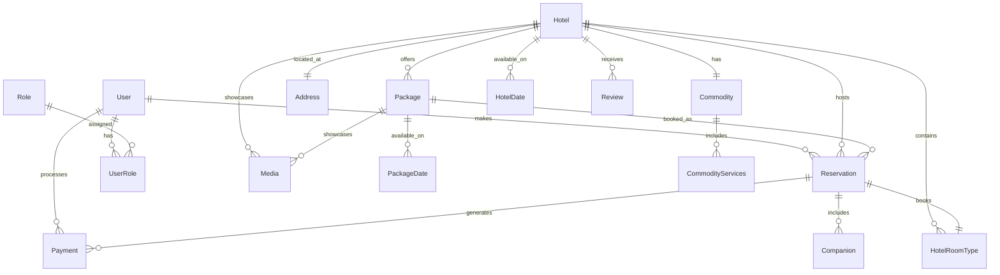

# 🌍 Viaggia Server API

<div align="center">


**Sistema de gerenciamento de viagens e reservas hoteleiras com autenticação robusta e arquitetura escalável.**

</div>

## 📋 Índice

- [🌍 Viaggia Server API](#-viaggia-server-api)
  - [📋 Índice](#-índice)
  - [📖 Sobre o Projeto](#-sobre-o-projeto)
  - [🚀 Tecnologias Utilizadas](#-tecnologias-utilizadas)
  - [🏗️ Arquitetura](#️-arquitetura)
    - [📁 Estrutura do Projeto](#-estrutura-do-projeto)
    - [🗂️ Camadas da Aplicação](#️-camadas-da-aplicação)
  - [📊 Modelo de Dados](#-modelo-de-dados)
    - [🔗 Relacionamentos Principais](#-relacionamentos-principais)
    - [👥 Entidades de Usuário](#-entidades-de-usuário)
    - [🏨 Entidades de Hotel](#-entidades-de-hotel)
    - [📦 Entidades de Pacote](#-entidades-de-pacote)
    - [📅 Entidades de Reserva](#-entidades-de-reserva)
  - [🔐 Sistema de Autenticação](#-sistema-de-autenticação)
  - [🚦 Endpoints da API](#-endpoints-da-api)
    - [🔑 Autenticação](#-autenticação)
    - [👤 Usuários](#-usuários)
    - [🏨 Hotéis](#-hotéis)
    - [📦 Pacotes](#-pacotes)
    - [📅 Reservas](#-reservas)
  - [⚙️ Configuração e Instalação](#️-configuração-e-instalação)
    - [📋 Pré-requisitos](#-pré-requisitos)
    - [🔧 Instalação](#-instalação)
    - [🗄️ Configuração do Banco de Dados](#️-configuração-do-banco-de-dados)
    - [🔑 Configuração do Google OAuth](#-configuração-do-google-oauth)
  - [🏃‍♂️ Como Executar](#️-como-executar)
  - [📖 Documentação da API](#-documentação-da-api)
  - [🧪 Testes](#-testes)
  - [🚀 Deploy](#-deploy)
  - [🤝 Contribuição](#-contribuição)
  - [📄 Licença](#-licença)
  - [👥 Equipe](#-equipe)

## 📖 Sobre o Projeto

O **Viaggia Server** é uma API REST desenvolvida em .NET 8 para gerenciar um sistema completo de viagens e reservas hoteleiras. A plataforma permite que usuários busquem, reservem e gerenciem pacotes de viagem, enquanto hotéis podem cadastrar suas acomodações e gerenciar disponibilidade.

### 🎯 Objetivos

- Facilitar a busca e reserva de hotéis e pacotes de viagem
- Gerenciar diferentes tipos de usuários (clientes, provedores, atendentes, administradores)
- Processar pagamentos e reservas de forma segura
- Fornecer sistema de avaliações e reviews
- Suportar autenticação via JWT e Google OAuth

## 🚀 Tecnologias Utilizadas

| Categoria | Tecnologia | Versão | Propósito |
|-----------|------------|--------|-----------|
| **Framework** | .NET | 8.0 | Framework principal |
| **ORM** | Entity Framework Core | 8.0.18 | Mapeamento objeto-relacional |
| **Banco de Dados** | SQL Server | 2019+ | Armazenamento de dados |
| **Autenticação** | JWT Bearer | 8.0.18 | Autenticação de usuários |
| **OAuth** | Google OAuth 2.0 | 8.0.18 | Login social |
| **Validação** | FluentValidation | 12.0.0 | Validação de DTOs |
| **Documentação** | Swagger/OpenAPI | 6.6.2 | Documentação da API |
| **Segurança** | BCrypt.Net | 4.0.2 | Hash de senhas |
| **Email** | MailKit | 4.13.0 | Envio de emails |

## 🏗️ Arquitetura

### 📁 Estrutura do Projeto

```
viaggia-server/
├── Controllers/           # Controladores da API
│   ├── AuthController.cs
│   ├── UserController.cs
│   ├── HotelsController.cs
│   ├── PackagesController.cs
│   └── AccountsController.cs
├── Data/                  # Contexto do banco de dados
│   └── AppDbContext.cs
├── DTOs/                  # Data Transfer Objects
│   ├── Auth/
│   ├── User/
│   ├── Hotel/
│   ├── Packages/
│   └── Review/
├── Models/                # Entidades do domínio
│   ├── User/
│   ├── Hotel/
│   ├── Package/
│   ├── Reservation/
│   ├── Payment/
│   └── Address/
├── Repositories/          # Padrão Repository
│   ├── User/
│   ├── Hotel/
│   ├── Package/
│   └── Commodities/
├── Services/              # Lógica de negócio
│   ├── Auth/
│   ├── User/
│   └── Hotel/
├── Validators/            # Validações com FluentValidation
├── Migrations/            # Migrações do Entity Framework
└── wwwroot/              # Arquivos estáticos
    └── Uploads/          # Upload de imagens
```

### 🗂️ Camadas da Aplicação

1. **Controllers**: Responsáveis por receber requisições HTTP e orquestrar chamadas aos serviços
2. **Services**: Contêm a lógica de negócio da aplicação
3. **Repositories**: Implementam o padrão Repository para acesso aos dados
4. **Models**: Definem as entidades do domínio
5. **DTOs**: Objetos para transferência de dados entre camadas
6. **Validators**: Validações utilizando FluentValidation

## 📊 Modelo de Dados

### 🔗 Relacionamentos Principais



### 👥 Entidades de Usuário

#### **User** (Usuário)
- **Campos Principais**: Id, Name, Email, Password, PhoneNumber
- **Campos OAuth**: GoogleId, AvatarUrl
- **Campos por Tipo**:
  - Cliente: CPF, DateOfBirth
  - Provedor: CNPJ, CompanyLegalName
  - Atendente: EmployerCompanyName, EmployeeId
- **Relacionamentos**: UserRoles, Reservations, Payments
- **Soft Delete**: Suporte via IsActive

#### **Role** (Papel/Função)
- **Tipos**: CLIENT, SERVICE_PROVIDER, ATTENDANT, ADMIN
- **Relacionamento**: Many-to-Many com User via UserRole

### 🏨 Entidades de Hotel

#### **Hotel**
- **Campos**: Name, CNPJ, Description, StarRating, CheckInTime, CheckOutTime
- **Contato**: ContactPhone, ContactEmail
- **Relacionamentos**: Address (1:1), Commodities (1:1), RoomTypes (1:N)
- **Coleções**: HotelDates, Reservations, Medias, Reviews, Packages

#### **HotelRoomType** (Tipo de Quarto)
- **Campos**: Name, Description, Price, Capacity, BedType
- **Relacionamento**: Pertence a um Hotel

#### **HotelDate** (Disponibilidade)
- **Campos**: StartDate, EndDate, AvailableRooms
- **Relacionamentos**: Hotel, HotelRoomType

#### **Address** (Endereço)
- **Campos**: Street, City, State, ZipCode
- **Herança**: BillingAddress extends Address
- **Relacionamento**: 1:1 com Hotel

#### **Commodity** (Comodidades)
- **Relacionamento**: 1:1 com Hotel
- **Serviços**: CommodityServices (1:N)

### 📦 Entidades de Pacote

#### **Package** (Pacote de Viagem)
- **Campos**: Name, Destination, Description, BasePrice
- **Relacionamentos**: Hotel (N:1), PackageDates (1:N), Medias (1:N)
- **Reservas**: Reservations (1:N)

#### **PackageDate** (Datas do Pacote)
- **Campos**: StartDate, EndDate
- **Relacionamento**: Package (N:1)

### 📅 Entidades de Reserva

#### **Reservation** (Reserva)
- **Campos**: StartDate, EndDate, TotalPrice, NumberOfGuests, Status
- **Relacionamentos**: User, Package (opcional), Hotel (opcional), HotelRoomType (opcional)
- **Coleções**: Payments, Companions

#### **Payment** (Pagamento)
- **Campos**: Amount, PaymentDate, PaymentMethod, Status
- **Relacionamentos**: User, Reservation, BillingAddress

#### **Companion** (Acompanhante)
- **Campos**: Name, DocumentNumber, DateOfBirth
- **Relacionamento**: Reservation

### 📸 Entidades de Mídia

#### **Media** (Mídia)
- **Campos**: MediaUrl, MediaType (image/video)
- **Relacionamentos**: Package ou Hotel (exclusivo)

#### **Review** (Avaliação)
- **Campos**: Rating, Comment, ReviewDate
- **Relacionamentos**: User, Hotel

## 🔐 Sistema de Autenticação

### 🔑 Autenticação JWT
- **Token Bearer**: Utilizado para autenticação da API
- **Claims**: UserId, Email, Roles
- **Configuração**: Issuer, Audience, SigningKey no appsettings.json

### 🌐 Google OAuth 2.0
- **Login Social**: Permite login via conta Google
- **Claims Mapeados**: sub → NameIdentifier, email → Email, name → Name
- **Fluxo**: Cookie + Google Authentication Scheme

### 👥 Sistema de Roles
- **CLIENT**: Usuários finais que fazem reservas
- **SERVICE_PROVIDER**: Hotéis e prestadores de serviço
- **ATTENDANT**: Funcionários de atendimento
- **ADMIN**: Administradores do sistema

## 🚦 Endpoints da API

### 🔑 Autenticação

| Método | Endpoint | Descrição | Auth |
|--------|----------|-----------|------|
| POST | `/api/auth/login` | Login com email/senha | ❌ |
| POST | `/api/auth/google` | Login via Google OAuth | ❌ |
| POST | `/api/auth/refresh` | Renovar token JWT | 🔐 |

### 👤 Usuários

| Método | Endpoint | Descrição | Auth |
|--------|----------|-----------|------|
| GET | `/api/user` | Listar usuários | 🔐 Admin |
| GET | `/api/user/{id}` | Buscar usuário por ID | 🔐 |
| POST | `/api/user/client` | Criar cliente | ❌ |
| POST | `/api/user/provider` | Criar provedor | ❌ |
| POST | `/api/user/attendant` | Criar atendente | 🔐 Admin |
| POST | `/api/user/admin` | Criar admin | 🔐 Admin |
| DELETE | `/api/user/{id}` | Soft delete usuário | 🔐 Admin |
| PUT | `/api/user/{id}/reactivate` | Reativar usuário | 🔐 Admin |

### 🏨 Hotéis

| Método | Endpoint | Descrição | Auth |
|--------|----------|-----------|------|
| GET | `/api/hotels` | Listar hotéis | ❌ |
| GET | `/api/hotels/{id}` | Buscar hotel por ID | ❌ |
| POST | `/api/hotels` | Criar hotel | 🔐 Provider |
| PUT | `/api/hotels/{id}` | Atualizar hotel | 🔐 Provider |
| DELETE | `/api/hotels/{id}` | Soft delete hotel | 🔐 Admin |
| GET | `/api/hotels/{id}/rooms` | Listar quartos | ❌ |
| POST | `/api/hotels/{id}/rooms` | Adicionar quarto | 🔐 Provider |

### 📦 Pacotes

| Método | Endpoint | Descrição | Auth |
|--------|----------|-----------|------|
| GET | `/api/packages` | Listar pacotes | ❌ |
| GET | `/api/packages/{id}` | Buscar pacote por ID | ❌ |
| POST | `/api/packages` | Criar pacote | 🔐 Provider |
| PUT | `/api/packages/{id}` | Atualizar pacote | 🔐 Provider |
| DELETE | `/api/packages/{id}` | Soft delete pacote | 🔐 Provider |
| GET | `/api/packages/{id}/dates` | Listar datas disponíveis | ❌ |
| POST | `/api/packages/{id}/dates` | Adicionar data | 🔐 Provider |
| GET | `/api/packages/search` | Buscar por destino/data | ❌ |

### 📅 Reservas

| Método | Endpoint | Descrição | Auth |
|--------|----------|-----------|------|
| GET | `/api/reservations` | Listar reservas do usuário | 🔐 |
| GET | `/api/reservations/{id}` | Buscar reserva por ID | 🔐 |
| POST | `/api/reservations` | Criar reserva | 🔐 Client |
| PUT | `/api/reservations/{id}` | Atualizar reserva | 🔐 |
| DELETE | `/api/reservations/{id}` | Cancelar reserva | 🔐 |

## ⚙️ Configuração e Instalação

### 📋 Pré-requisitos

- **.NET 8.0 SDK** ou superior
- **SQL Server 2019** ou superior (LocalDB aceito para desenvolvimento)
- **Visual Studio 2022** ou **VS Code** com extensão C#
- **Git** para controle de versão

### 🔧 Instalação

1. **Clone o repositório**:
```bash
git clone https://github.com/seu-usuario/viaggia-server.git
cd viaggia-server
```

2. **Restaure as dependências**:
```bash
dotnet restore
```

3. **Configure o User Secrets** para desenvolvimento:
```bash
dotnet user-secrets init
dotnet user-secrets set "ConnectionStrings:DefaultConnection" "Server=(localdb)\\mssqllocaldb;Database=ViaggiaDb;Trusted_Connection=True;TrustServerCertificate=True;"
dotnet user-secrets set "Jwt:Key" "sua-chave-secreta-muito-segura-de-32-caracteres"
dotnet user-secrets set "Jwt:Issuer" "ViaggiaServer"
dotnet user-secrets set "Jwt:Audience" "ViaggiaClient"
dotnet user-secrets set "Authentication:Google:ClientId" "seu-google-client-id"
dotnet user-secrets set "Authentication:Google:ClientSecret" "seu-google-client-secret"
```

### 🗄️ Configuração do Banco de Dados

1. **Execute as migrações**:
```bash
dotnet ef database update
```

2. **Ou crie uma nova migração** (se necessário):
```bash
dotnet ef migrations add NomeDaMigracao
dotnet ef database update
```

### 🔑 Configuração do Google OAuth

1. Acesse o [Google Cloud Console](https://console.cloud.google.com/)
2. Crie um novo projeto ou selecione um existente
3. Habilite a **Google+ API**
4. Crie credenciais OAuth 2.0:
   - **Tipo**: Aplicação Web
   - **URIs de redirecionamento**: `https://localhost:7000/signin-google`
5. Configure as credenciais no User Secrets

## 🏃‍♂️ Como Executar

### 🔥 Desenvolvimento

```bash
# Executar em modo de desenvolvimento
dotnet run --launch-profile "https"

# Ou usar o watch para hot reload
dotnet watch run --launch-profile "https"
```

### 🌐 URLs de Acesso

- **API**: `https://localhost:7000`
- **Swagger**: `https://localhost:7000/swagger`
- **HTTP**: `http://localhost:5000` (redirecionado para HTTPS)

### 🐳 Docker (Opcional)

```bash
# Build da imagem
docker build -t viaggia-server .

# Executar container
docker run -p 8080:80 viaggia-server
```

## 📖 Documentação da API

A documentação completa da API está disponível através do **Swagger UI**:

- **URL**: `https://localhost:7000/swagger`
- **OpenAPI JSON**: `https://localhost:7000/swagger/v1/swagger.json`

### 🔐 Autenticação no Swagger

1. Execute uma requisição de login para obter o token JWT
2. Clique no botão **"Authorize"** no Swagger
3. Digite: `Bearer seu-token-jwt-aqui`
4. Todas as requisições subsequentes incluirão o token automaticamente

## 🧪 Testes

### 🧪 Testes Unitários

```bash
# Executar todos os testes
dotnet test

# Executar com cobertura
dotnet test --collect:"XPlat Code Coverage"
```

### 🔍 Testes de Integração

```bash
# Executar testes de integração
dotnet test --filter Category=Integration
```

### 📊 Collection do Postman

Importe a collection disponível em `docs/Viaggia-API.postman_collection.json` para testar todos os endpoints.

## 🚀 Deploy

### ☁️ Azure App Service

1. **Publique via Visual Studio**:
   - Clique com botão direito no projeto → **Publish**
   - Selecione **Azure** → **Azure App Service**

2. **Ou via CLI**:
```bash
# Login no Azure
az login

# Deploy
dotnet publish -c Release
az webapp deployment source config-zip --resource-group myResourceGroup --name myAppName --src publish.zip
```

### 🐳 Docker + Azure Container Instances

```bash
# Build e push para Azure Container Registry
az acr build --registry myregistry --image viaggia-server .

# Deploy para Container Instances
az container create --resource-group myResourceGroup --name viaggia-server --image myregistry.azurecr.io/viaggia-server:latest
```

### 🔧 Variáveis de Ambiente (Produção)

Configure as seguintes variáveis no ambiente de produção:

```env
ConnectionStrings__DefaultConnection=sua-connection-string-producao
Jwt__Key=sua-chave-jwt-segura
Jwt__Issuer=ViaggiaServer
Jwt__Audience=ViaggiaClient
Authentication__Google__ClientId=seu-google-client-id
Authentication__Google__ClientSecret=seu-google-client-secret
ASPNETCORE_ENVIRONMENT=Production
```

## 🤝 Contribuição

### 🔄 Fluxo de Contribuição

1. **Fork** o projeto
2. Crie uma **branch** para sua feature (`git checkout -b feature/AmazingFeature`)
3. **Commit** suas mudanças (`git commit -m 'Add some AmazingFeature'`)
4. **Push** para a branch (`git push origin feature/AmazingFeature`)
5. Abra um **Pull Request**

### 📏 Padrões de Código

- Use **PascalCase** para classes e métodos públicos
- Use **camelCase** para variáveis locais e parâmetros
- Siga os padrões do **.editorconfig**
- Adicione **testes unitários** para novas funcionalidades
- Documente métodos públicos com **XML comments**

### 📋 Checklist do PR

- [ ] Código segue os padrões estabelecidos
- [ ] Testes unitários adicionados/atualizados
- [ ] Documentação atualizada
- [ ] Migrations criadas (se necessário)
- [ ] Sem breaking changes (ou documentados)

## 📄 Licença

Este projeto está licenciado sob a **MIT License** - veja o arquivo [LICENSE](LICENSE) para detalhes.

## 👥 Equipe

| Nome | Função | GitHub | LinkedIn |
|------|--------|--------|----------|
| **R. Freitas dos Anjos** | Desenvolvedor Principal | [@rfreitas](https://github.com/rfreitas) | [LinkedIn](https://linkedin.com/in/rfreitas) |

---

<div align="center">

**⭐ Se este projeto foi útil para você, considere dar uma estrela!**

**📧 Dúvidas? Entre em contato:** [email@example.com](mailto:email@example.com)

</div>
