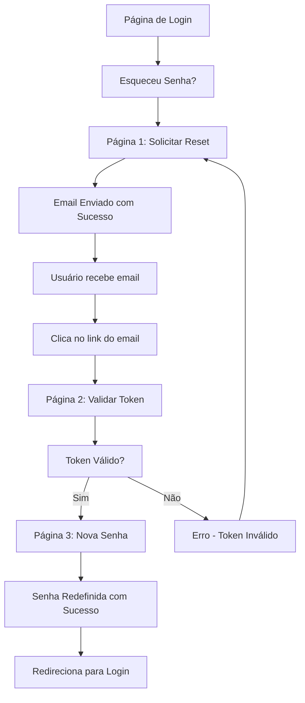

# 🎨 Documentação Frontend - Sistema de Recuperação de Senha

## 🎯 Visão Geral

Este documento detalha como implementar o frontend para o sistema de recuperação de senha do Viaggia, incluindo wireframes, fluxos de navegação, validações e exemplos de código.

---

## 🗺️ Fluxo de Navegação



---

## 📄 Páginas Detalhadas

### **PÁGINA 1: Solicitar Reset de Senha**
**URL:** `/forgot-password`

#### **Layout Sugerido:**
```html
<div class="forgot-password-container">
    <div class="header">
        <h1>🔐 Recuperar Senha</h1>
        <p>Digite seu email para receber instruções de recuperação</p>
    </div>
    
    <form id="forgotPasswordForm">
        <div class="input-group">
            <label for="email">Email:</label>
            <input 
                type="email" 
                id="email" 
                placeholder="seu@email.com" 
                required 
                autocomplete="email"
            />
            <span class="error-message" id="emailError"></span>
        </div>
        
        <button type="submit" class="btn-primary" id="submitBtn">
            <span class="btn-text">Enviar Link de Recuperação</span>
            <span class="loading" style="display: none;">⏳ Enviando...</span>
        </button>
    </form>
    
    <div class="links">
        <a href="/login">← Voltar ao Login</a>
    </div>
</div>
```

#### **JavaScript da Página 1:**
```javascript
document.getElementById('forgotPasswordForm').addEventListener('submit', async (e) => {
    e.preventDefault();
    
    const email = document.getElementById('email').value;
    const submitBtn = document.getElementById('submitBtn');
    const btnText = submitBtn.querySelector('.btn-text');
    const loading = submitBtn.querySelector('.loading');
    
    // UI Loading
    submitBtn.disabled = true;
    btnText.style.display = 'none';
    loading.style.display = 'inline';
    
    try {
        const response = await fetch('/api/auth/forgot-password', {
            method: 'POST',
            headers: {
                'Content-Type': 'application/json',
            },
            body: JSON.stringify({ email })
        });
        
        const data = await response.json();
        
        if (response.ok) {
            // Sucesso - redirecionar para página de confirmação
            sessionStorage.setItem('resetEmail', email);
            window.location.href = '/email-sent';
        } else {
            // Erro - mostrar mensagem
            showError('emailError', data.message);
        }
    } catch (error) {
        showError('emailError', 'Erro de conexão. Tente novamente.');
    } finally {
        // Reset UI
        submitBtn.disabled = false;
        btnText.style.display = 'inline';
        loading.style.display = 'none';
    }
});

function showError(elementId, message) {
    const errorElement = document.getElementById(elementId);
    errorElement.textContent = message;
    errorElement.style.display = 'block';
    setTimeout(() => {
        errorElement.style.display = 'none';
    }, 5000);
}
```

---

### **PÁGINA INTERMEDIÁRIA: Email Enviado**
**URL:** `/email-sent`

#### **Layout Sugerido:**
```html
<div class="email-sent-container">
    <div class="success-icon">📧</div>
    <h1>Email Enviado com Sucesso!</h1>
    <p>Enviamos as instruções de recuperação de senha para:</p>
    <strong id="userEmail"></strong>
    
    <div class="instructions">
        <h3>📋 Próximos passos:</h3>
        <ol>
            <li>Verifique sua caixa de entrada (e spam)</li>
            <li>Clique no link recebido ou copie o token</li>
            <li>Complete o processo de recuperação</li>
        </ol>
    </div>
    
    <div class="manual-entry">
        <p>Já recebeu o email? <a href="#" id="manualTokenLink">Inserir token manualmente</a></p>
    </div>
    
    <div class="links">
        <a href="/forgot-password">← Enviar para outro email</a>
        <a href="/login">Voltar ao Login</a>
    </div>
</div>
```

#### **JavaScript da Página Intermediária:**
```javascript
document.addEventListener('DOMContentLoaded', () => {
    // Mostrar email que foi enviado
    const email = sessionStorage.getItem('resetEmail');
    if (email) {
        document.getElementById('userEmail').textContent = email;
    }
    
    // Link para entrada manual de token
    document.getElementById('manualTokenLink').addEventListener('click', (e) => {
        e.preventDefault();
        window.location.href = '/validate-token';
    });
});
```

---

### **PÁGINA 2: Validar Token**
**URL:** `/validate-token` ou `/validate-token?token=XXXXX`

#### **Layout Sugerido:**
```html
<div class="validate-token-container">
    <div class="header">
        <h1>🔑 Validar Token de Segurança</h1>
        <div id="userGreeting" style="display: none;">
            <p>Olá, <strong id="userName"></strong>!</p>
        </div>
    </div>
    
    <form id="validateTokenForm">
        <div class="input-group">
            <label for="token">Token de Segurança:</label>
            <input 
                type="text" 
                id="token" 
                placeholder="Cole ou digite o token aqui" 
                required 
                autocomplete="off"
                maxlength="36"
            />
            <span class="error-message" id="tokenError"></span>
            <small class="help-text">
                Token enviado por email (formato: 12345678-90ab-cdef-1234-567890abcdef)
            </small>
        </div>
        
        <button type="submit" class="btn-primary" id="validateBtn">
            <span class="btn-text">Validar Token</span>
            <span class="loading" style="display: none;">🔍 Validando...</span>
        </button>
    </form>
    
    <div class="token-info" id="tokenInfo" style="display: none;">
        <div class="info-card">
            <h3>✅ Token Válido!</h3>
            <p><strong>Email:</strong> <span id="tokenEmail"></span></p>
            <p><strong>Expira em:</strong> <span id="tokenExpiry"></span></p>
        </div>
        
        <button class="btn-success" id="proceedBtn">
            Continuar para Nova Senha →
        </button>
    </div>
    
    <div class="links">
        <a href="/forgot-password">← Solicitar novo token</a>
        <a href="/login">Voltar ao Login</a>
    </div>
</div>
```

#### **JavaScript da Página 2:**
```javascript
document.addEventListener('DOMContentLoaded', () => {
    // Auto-preencher token se vier da URL
    const urlParams = new URLSearchParams(window.location.search);
    const tokenFromUrl = urlParams.get('token');
    if (tokenFromUrl) {
        document.getElementById('token').value = tokenFromUrl;
        // Auto-validar se o token veio da URL
        validateToken(tokenFromUrl);
    }
});

document.getElementById('validateTokenForm').addEventListener('submit', async (e) => {
    e.preventDefault();
    const token = document.getElementById('token').value;
    await validateToken(token);
});

async function validateToken(token) {
    const validateBtn = document.getElementById('validateBtn');
    const btnText = validateBtn.querySelector('.btn-text');
    const loading = validateBtn.querySelector('.loading');
    
    // UI Loading
    validateBtn.disabled = true;
    btnText.style.display = 'none';
    loading.style.display = 'inline';
    
    try {
        const response = await fetch('/api/auth/validate-token', {
            method: 'POST',
            headers: {
                'Content-Type': 'application/json',
            },
            body: JSON.stringify({ token })
        });
        
        const data = await response.json();
        
        if (response.ok && data.isValid) {
            // Token válido - mostrar informações e botão de continuar
            showTokenValid(data);
            
            // Salvar token para próxima página
            sessionStorage.setItem('validToken', token);
            sessionStorage.setItem('resetUserName', data.userName);
        } else {
            // Token inválido
            showError('tokenError', data.message);
        }
    } catch (error) {
        showError('tokenError', 'Erro de conexão. Tente novamente.');
    } finally {
        // Reset UI
        validateBtn.disabled = false;
        btnText.style.display = 'inline';
        loading.style.display = 'none';
    }
}

function showTokenValid(data) {
    // Mostrar saudação personalizada
    document.getElementById('userName').textContent = data.userName;
    document.getElementById('userGreeting').style.display = 'block';
    
    // Mostrar informações do token
    document.getElementById('tokenEmail').textContent = data.email;
    document.getElementById('tokenExpiry').textContent = formatDate(data.expiryDate);
    document.getElementById('tokenInfo').style.display = 'block';
    
    // Configurar botão de continuar
    document.getElementById('proceedBtn').addEventListener('click', () => {
        window.location.href = '/reset-password';
    });
}

function formatDate(dateString) {
    const date = new Date(dateString);
    return date.toLocaleString('pt-BR', {
        day: '2-digit',
        month: '2-digit',
        year: 'numeric',
        hour: '2-digit',
        minute: '2-digit'
    });
}
```

---

### **PÁGINA 3: Redefinir Senha**
**URL:** `/reset-password`

#### **Layout Sugerido:**
```html
<div class="reset-password-container">
    <div class="header">
        <h1>🔐 Definir Nova Senha</h1>
        <p id="userGreeting">Olá, <strong id="userName"></strong>! Defina sua nova senha abaixo.</p>
    </div>
    
    <form id="resetPasswordForm">
        <div class="input-group">
            <label for="newPassword">Nova Senha:</label>
            <input 
                type="password" 
                id="newPassword" 
                placeholder="Digite sua nova senha" 
                required 
                autocomplete="new-password"
            />
            <span class="error-message" id="passwordError"></span>
        </div>
        
        <div class="input-group">
            <label for="confirmPassword">Confirmar Senha:</label>
            <input 
                type="password" 
                id="confirmPassword" 
                placeholder="Confirme sua nova senha" 
                required 
                autocomplete="new-password"
            />
            <span class="error-message" id="confirmError"></span>
        </div>
        
        <div class="password-requirements">
            <h4>📋 Requisitos da senha:</h4>
            <ul id="passwordChecklist">
                <li id="req-length">Mínimo 8 caracteres</li>
                <li id="req-lowercase">1 letra minúscula</li>
                <li id="req-uppercase">1 letra maiúscula</li>
                <li id="req-number">1 número</li>
                <li id="req-special">1 caractere especial (@$!%*?&)</li>
            </ul>
        </div>
        
        <button type="submit" class="btn-primary" id="resetBtn">
            <span class="btn-text">🔄 Redefinir Senha</span>
            <span class="loading" style="display: none;">⏳ Processando...</span>
        </button>
    </form>
    
    <div class="links">
        <a href="/validate-token">← Voltar para validação</a>
    </div>
</div>
```

#### **JavaScript da Página 3:**
```javascript
document.addEventListener('DOMContentLoaded', () => {
    // Verificar se tem token válido
    const token = sessionStorage.getItem('validToken');
    const userName = sessionStorage.getItem('resetUserName');
    
    if (!token) {
        // Redirecionar para início do processo
        window.location.href = '/forgot-password';
        return;
    }
    
    // Mostrar nome do usuário
    if (userName) {
        document.getElementById('userName').textContent = userName;
    }
    
    // Configurar validação em tempo real
    const passwordInput = document.getElementById('newPassword');
    const confirmInput = document.getElementById('confirmPassword');
    
    passwordInput.addEventListener('input', validatePasswordStrength);
    confirmInput.addEventListener('input', validatePasswordMatch);
});

document.getElementById('resetPasswordForm').addEventListener('submit', async (e) => {
    e.preventDefault();
    
    const token = sessionStorage.getItem('validToken');
    const newPassword = document.getElementById('newPassword').value;
    const confirmPassword = document.getElementById('confirmPassword').value;
    
    // Validações locais
    if (!validatePasswordStrength()) return;
    if (!validatePasswordMatch()) return;
    
    const resetBtn = document.getElementById('resetBtn');
    const btnText = resetBtn.querySelector('.btn-text');
    const loading = resetBtn.querySelector('.loading');
    
    // UI Loading
    resetBtn.disabled = true;
    btnText.style.display = 'none';
    loading.style.display = 'inline';
    
    try {
        const response = await fetch('/api/auth/reset-password', {
            method: 'POST',
            headers: {
                'Content-Type': 'application/json',
            },
            body: JSON.stringify({
                token,
                newPassword,
                confirmPassword
            })
        });
        
        const data = await response.json();
        
        if (response.ok) {
            // Sucesso - mostrar página de confirmação
            sessionStorage.clear(); // Limpar dados sensíveis
            window.location.href = '/password-reset-success';
        } else {
            // Erro
            showError('passwordError', data.message);
        }
    } catch (error) {
        showError('passwordError', 'Erro de conexão. Tente novamente.');
    } finally {
        // Reset UI
        resetBtn.disabled = false;
        btnText.style.display = 'inline';
        loading.style.display = 'none';
    }
});

function validatePasswordStrength() {
    const password = document.getElementById('newPassword').value;
    const requirements = {
        'req-length': password.length >= 8,
        'req-lowercase': /[a-z]/.test(password),
        'req-uppercase': /[A-Z]/.test(password),
        'req-number': /\d/.test(password),
        'req-special': /[@$!%*?&]/.test(password)
    };
    
    let allValid = true;
    
    for (const [id, isValid] of Object.entries(requirements)) {
        const element = document.getElementById(id);
        if (isValid) {
            element.classList.add('valid');
            element.classList.remove('invalid');
        } else {
            element.classList.add('invalid');
            element.classList.remove('valid');
            allValid = false;
        }
    }
    
    return allValid;
}

function validatePasswordMatch() {
    const password = document.getElementById('newPassword').value;
    const confirm = document.getElementById('confirmPassword').value;
    
    if (confirm && password !== confirm) {
        showError('confirmError', 'Senhas não coincidem');
        return false;
    } else {
        hideError('confirmError');
        return true;
    }
}
```

---

### **PÁGINA FINAL: Sucesso**
**URL:** `/password-reset-success`

#### **Layout Sugerido:**
```html
<div class="success-container">
    <div class="success-icon">🎉</div>
    <h1>Senha Redefinida com Sucesso!</h1>
    <p>Sua senha foi alterada com segurança.</p>
    
    <div class="next-steps">
        <h3>🔐 Próximos passos:</h3>
        <ol>
            <li>Faça login com sua nova senha</li>
            <li>Consider ativar autenticação de dois fatores</li>
            <li>Mantenha sua senha segura</li>
        </ol>
    </div>
    
    <div class="actions">
        <a href="/login" class="btn-primary">Fazer Login</a>
        <a href="/" class="btn-secondary">Ir para Início</a>
    </div>
</div>
```

---

## 🎨 CSS Sugerido

```css
/* Estilos base para todas as páginas */
.forgot-password-container,
.email-sent-container,
.validate-token-container,
.reset-password-container,
.success-container {
    max-width: 500px;
    margin: 50px auto;
    padding: 30px;
    background: white;
    border-radius: 12px;
    box-shadow: 0 4px 20px rgba(0,0,0,0.1);
}

.header {
    text-align: center;
    margin-bottom: 30px;
}

.header h1 {
    color: #2c3e50;
    margin-bottom: 10px;
}

.input-group {
    margin-bottom: 20px;
}

.input-group label {
    display: block;
    margin-bottom: 5px;
    font-weight: 600;
    color: #2c3e50;
}

.input-group input {
    width: 100%;
    padding: 12px;
    border: 2px solid #e0e0e0;
    border-radius: 8px;
    font-size: 16px;
    transition: border-color 0.3s;
}

.input-group input:focus {
    outline: none;
    border-color: #007bff;
}

.error-message {
    display: none;
    color: #dc3545;
    font-size: 14px;
    margin-top: 5px;
}

.help-text {
    color: #6c757d;
    font-size: 12px;
    margin-top: 5px;
}

.btn-primary, .btn-success, .btn-secondary {
    width: 100%;
    padding: 12px;
    border: none;
    border-radius: 8px;
    font-size: 16px;
    font-weight: 600;
    cursor: pointer;
    transition: all 0.3s;
    text-decoration: none;
    display: inline-block;
    text-align: center;
    margin: 5px 0;
}

.btn-primary {
    background: #007bff;
    color: white;
}

.btn-primary:hover {
    background: #0056b3;
}

.btn-success {
    background: #28a745;
    color: white;
}

.btn-secondary {
    background: #6c757d;
    color: white;
}

.btn-primary:disabled {
    background: #ccc;
    cursor: not-allowed;
}

.links {
    text-align: center;
    margin-top: 30px;
}

.links a {
    color: #007bff;
    text-decoration: none;
    margin: 0 10px;
}

/* Estilos específicos */
.success-icon {
    font-size: 64px;
    text-align: center;
    margin-bottom: 20px;
}

.info-card {
    background: #e8f5e8;
    padding: 20px;
    border-radius: 8px;
    margin-bottom: 20px;
}

.password-requirements {
    background: #f8f9fa;
    padding: 15px;
    border-radius: 8px;
    margin-bottom: 20px;
}

.password-requirements ul {
    list-style: none;
    padding: 0;
}

.password-requirements li {
    padding: 5px 0;
    position: relative;
    padding-left: 25px;
}

.password-requirements li:before {
    content: "❌";
    position: absolute;
    left: 0;
}

.password-requirements li.valid:before {
    content: "✅";
}

.password-requirements li.invalid:before {
    content: "❌";
}

.instructions {
    background: #e3f2fd;
    padding: 20px;
    border-radius: 8px;
    margin: 20px 0;
}

.next-steps {
    background: #f0f8f0;
    padding: 20px;
    border-radius: 8px;
    margin: 20px 0;
}

@media (max-width: 600px) {
    .forgot-password-container,
    .email-sent-container,
    .validate-token-container,
    .reset-password-container,
    .success-container {
        margin: 20px;
        padding: 20px;
    }
}
```

---

## 🔒 Considerações de Segurança Frontend

### **1. Validação de Entrada**
- ✅ Validar email no frontend antes do envio
- ✅ Validar força da senha em tempo real
- ✅ Sanitizar inputs contra XSS

### **2. Gerenciamento de Estado**
- ✅ Usar `sessionStorage` para dados temporários
- ✅ Limpar dados sensíveis após uso
- ✅ Verificar estado válido em cada página

### **3. UX/UI de Segurança**
- ✅ Mostrar requisitos de senha claramente
- ✅ Feedback visual imediato
- ✅ Timeouts visuais para expiração de token

### **4. Acessibilidade**
- ✅ Labels apropriados para screen readers
- ✅ Navegação por teclado
- ✅ Contraste adequado de cores

---

## 📱 Responsividade

O design deve ser responsivo para:
- 📱 **Mobile:** 320px - 767px
- 📱 **Tablet:** 768px - 1023px  
- 💻 **Desktop:** 1024px+

---

## 🧪 Testes Frontend

### **Casos de Teste:**
1. ✅ Email válido/inválido
2. ✅ Token válido/inválido/expirado
3. ✅ Senha forte/fraca
4. ✅ Senhas coincidentes/diferentes
5. ✅ Navegação entre páginas
6. ✅ Refresh da página com estado
7. ✅ Conexão offline/online

---

## 🚀 Integração com Frameworks

### **React/Next.js:**
- Use `useState` para gerenciar estados locais
- Use `useRouter` para navegação
- Considere `react-hook-form` para validação

### **Vue.js:**
- Use `ref/reactive` para reatividade
- Use `vue-router` para navegação
- Considere `vee-validate` para validação

### **Angular:**
- Use `FormBuilder` para formulários
- Use `Router` para navegação
- Use `Validators` para validação

---

Esta documentação fornece uma base sólida para implementar o frontend do sistema de recuperação de senha de forma profissional e segura! 🎯
