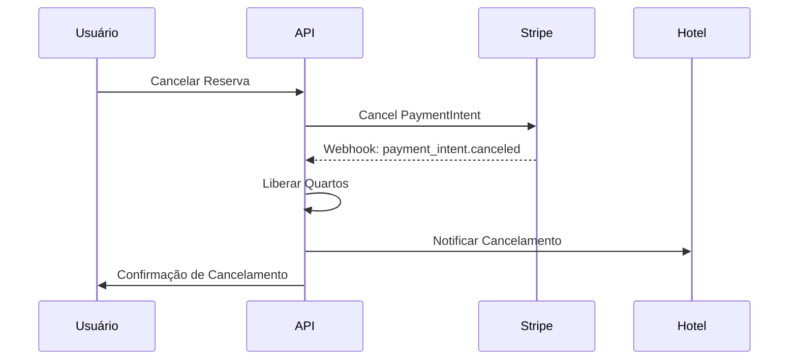
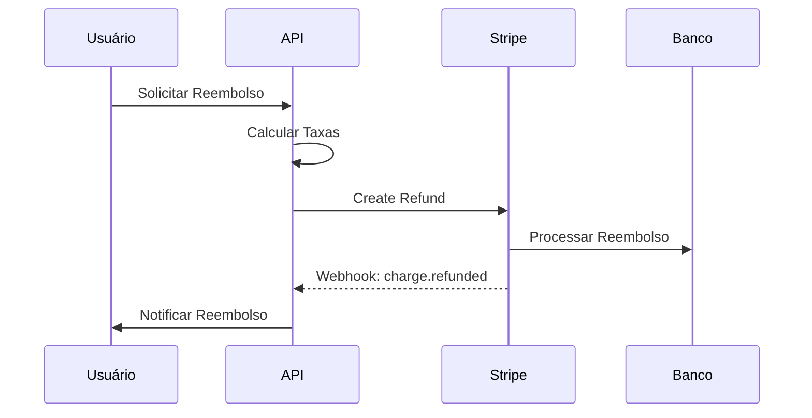

# 💳 Sistema de Pagamentos - Viaggia

## 📋 Visão Geral

O sistema de pagamentos do Viaggia utiliza **Stripe** como gateway de pagamento, oferecendo uma solução robusta e segura para processar transações de reservas de viagem. Este documento detalha toda a implementação, fluxos de pagamento e webhooks.

## 🏗️ Arquitetura do Sistema

```
┌─────────────────┐    ┌─────────────────┐    ┌─────────────────┐
│   Frontend      │    │   Viaggia API   │    │     Stripe      │
│   (React)       │    │   (.NET Core)   │    │   (Gateway)     │
└─────────────────┘    └─────────────────┘    └─────────────────┘
         │                       │                       │
         │  1. Criar Intent      │                       │
         ├──────────────────────►│  2. Create PaymentIntent
         │                       ├──────────────────────►│
         │                       │  3. Return ClientSecret
         │  4. ClientSecret      │◄──────────────────────┤
         │◄──────────────────────┤                       │
         │                       │                       │
         │  5. Confirmar Pagto   │                       │
         ├──────────────────────►│  6. Confirm Payment   │
         │                       ├──────────────────────►│
         │                       │  7. Webhook Events    │
         │                       │◄──────────────────────┤
         │  8. Status Final      │                       │
         │◄──────────────────────┤                       │
```

## 🔄 Fluxos de Pagamento

### 1. **Fluxo Principal de Pagamento**

#### **Passo 1: Criação do Payment Intent**
```csharp
POST /api/payments/create-intent
{
  "amount": 599.99,
  "currency": "brl",
  "description": "Pacote Paris Romântico - 3 dias",
  "packageId": 1,
  "metadata": {
    "reservationId": "123",
    "userId": "456"
  }
}
```

#### **Passo 2: Processamento no Frontend**
```javascript
// Frontend React com Stripe Elements
const stripe = Stripe('pk_test_...');
const elements = stripe.elements();

// Confirmar pagamento
const {error, paymentIntent} = await stripe.confirmCardPayment(
  clientSecret, 
  {
    payment_method: {
      card: cardElement,
      billing_details: {
        name: 'João Silva'
      }
    }
  }
);
```

#### **Passo 3: Webhook de Confirmação**
```csharp
// Webhook automático do Stripe
POST /api/webhook/stripe
{
  "type": "payment_intent.succeeded",
  "data": {
    "object": {
      "id": "pi_1234567890",
      "amount": 59999,
      "status": "succeeded"
    }
  }
}
```

### 2. **Fluxo de Cancelamento**



### 3. **Fluxo de Reembolso**



## 📊 Eventos de Webhook Implementados

| Evento | Prioridade | Ação no Sistema |
|--------|------------|-----------------|
| `payment_intent.succeeded` | 🔴 CRÍTICA | Confirmar reserva, enviar voucher |
| `payment_intent.payment_failed` | 🔴 CRÍTICA | Liberar quartos, notificar usuário |
| `payment_intent.canceled` | 🟠 ALTA | Cancelar pré-reservas |
| `charge.refunded` | 🟠 ALTA | Processar cancelamento |
| `charge.dispute.created` | 🟡 MÉDIA | Coletar evidências |
| `payment_intent.requires_action` | 🟡 MÉDIA | 3D Secure authentication |

### **Configuração de Webhook no Stripe**

1. **URL do Endpoint**: `https://sua-api.com/api/webhook/stripe`
2. **Eventos Selecionados**:
   - ✅ `payment_intent.succeeded`
   - ✅ `payment_intent.payment_failed`
   - ✅ `payment_intent.canceled`
   - ✅ `charge.refunded`
   - ✅ `charge.dispute.created`
   - ✅ `payment_intent.requires_action`

## 🛡️ Segurança

### **1. Validação de Webhook**
```csharp
var stripeEvent = EventUtility.ConstructEvent(
    json,
    Request.Headers["Stripe-Signature"],
    webhookSecret
);
```

### **2. Idempotência**
```csharp
public async Task<bool> ProcessPaymentWebhook(string eventId)
{
    // Verificar se evento já foi processado
    var existingEvent = await _context.ProcessedWebhooks
        .FirstOrDefaultAsync(e => e.StripeEventId == eventId);
        
    if (existingEvent != null)
    {
        _logger.LogInformation("Evento já processado: {EventId}", eventId);
        return true; // Já processado
    }
    
    // Processar evento...
    await _context.ProcessedWebhooks.AddAsync(new ProcessedWebhook 
    { 
        StripeEventId = eventId,
        ProcessedAt = DateTime.UtcNow 
    });
}
```

### **3. Rate Limiting**
```csharp
[EnableRateLimiting("WebhookPolicy")]
[HttpPost("stripe")]
public async Task<IActionResult> StripeWebhook()
{
    // Limitar a 100 webhooks por minuto
}
```

## 🏨 Lógicas Específicas para Turismo

### **1. Confirmação de Reserva**
```csharp
private async Task HandlePaymentIntentSucceeded(Event stripeEvent)
{
    var paymentIntent = stripeEvent.Data.Object as PaymentIntent;
    
    // 1. Atualizar status do pagamento
    await _stripePaymentService.UpdatePaymentStatusAsync(
        paymentIntent.Id, "succeeded", paymentIntent.Amount);
    
    // 2. Confirmar reserva definitivamente
    await _travelService.ConfirmReservationAsync(paymentIntent.Id);
    
    // 3. Enviar voucher por email
    await _travelService.SendConfirmationVoucherAsync(paymentIntent.Id);
    
    // 4. Notificar hotel parceiro
    await _travelService.NotifyHotelPartnersAsync(
        hotelId, "reservation_confirmed", reservationData);
    
    // 5. Atualizar disponibilidade
    await _hotelService.UpdateRoomAvailabilityAsync(hotelId, roomType, dates);
}
```

### **2. Liberação de Quartos**
```csharp
private async Task HandlePaymentIntentFailed(Event stripeEvent)
{
    var paymentIntent = stripeEvent.Data.Object as PaymentIntent;
    
    // 1. Liberar quartos reservados temporariamente
    await _travelService.ReleaseTemporaryReservationAsync(paymentIntent.Id);
    
    // 2. Notificar usuário sobre falha
    await _notificationService.SendPaymentFailedNotificationAsync(
        userId, paymentIntent.LastPaymentError?.Message);
    
    // 3. Oferecer métodos alternativos
    await _emailService.SendAlternativePaymentMethodsAsync(userId);
}
```

### **3. Políticas de Reembolso**
```csharp
public async Task<decimal> CalculateRefundAmountAsync(
    string paymentIntentId, DateTime cancellationDate)
{
    var payment = await GetPaymentByIntentIdAsync(paymentIntentId);
    var reservation = await GetReservationByPaymentAsync(payment.Id);
    
    var daysUntilCheckIn = (reservation.CheckInDate - cancellationDate).Days;
    
    return daysUntilCheckIn switch
    {
        >= 7 => payment.Amount, // Reembolso total
        >= 3 => payment.Amount * 0.5m, // 50% de reembolso
        >= 1 => payment.Amount * 0.1m, // 10% de reembolso
        _ => 0 // Sem reembolso
    };
}
```

## 📈 Monitoramento e Métricas

### **1. Métricas Importantes**
- Taxa de sucesso de pagamentos
- Tempo médio de processamento
- Taxa de disputas/chargebacks
- Volume de reembolsos

### **2. Alertas Configurados**
```csharp
// Alerta para taxa de falha alta
if (failureRate > 0.05) // 5%
{
    await _alertService.SendCriticalAlertAsync(
        "Taxa de falha de pagamentos acima de 5%");
}

// Alerta para webhook falhando
if (webhookFailures > 5)
{
    await _alertService.SendUrgentAlertAsync(
        "Webhooks do Stripe falhando consecutivamente");
}
```

### **3. Logs Estruturados**
```csharp
_logger.LogInformation("Pagamento processado: {PaymentIntentId} - " +
    "Valor: R$ {Amount:F2} - Status: {Status} - Usuário: {UserId}",
    paymentIntent.Id, amount, status, userId);
```

## 🧪 Testes

### **1. Teste de Webhooks Localmente**
```bash
# Instalar Stripe CLI
stripe login

# Escutar webhooks localmente
stripe listen --forward-to localhost:5223/api/webhook/stripe

# Simular eventos
stripe trigger payment_intent.succeeded
stripe trigger payment_intent.payment_failed
stripe trigger charge.dispute.created
```

### **2. Cartões de Teste**
| Cartão | Resultado |
|--------|-----------|
| `4242424242424242` | Sucesso |
| `4000000000000002` | Falha (cartão recusado) |
| `4000000000009995` | Falha (saldo insuficiente) |
| `4000000000000119` | Requer 3D Secure |

### **3. Testes de Integração**
```csharp
[Test]
public async Task CreatePaymentIntent_ShouldReturnValidClientSecret()
{
    // Arrange
    var request = new CreatePaymentIntentDTO
    {
        Amount = 599.99m,
        PackageId = 1,
        Description = "Teste"
    };
    
    // Act
    var result = await _paymentService.CreatePaymentIntentAsync(request, userId);
    
    // Assert
    Assert.That(result.ClientSecret, Is.Not.Null);
    Assert.That(result.Amount, Is.EqualTo(59999)); // Centavos
}
```

## 🚀 Deploy e Configuração

### **1. Variáveis de Ambiente**
```bash
# Desenvolvimento
STRIPE_SECRET_KEY=sk_test_...
STRIPE_WEBHOOK_SECRET=whsec_...
STRIPE_PUBLISHABLE_KEY=pk_test_...

# Produção
STRIPE_SECRET_KEY=sk_live_...
STRIPE_WEBHOOK_SECRET=whsec_...
STRIPE_PUBLISHABLE_KEY=pk_live_...
```

### **2. Configuração nginx**
```nginx
location /api/webhook/stripe {
    proxy_pass http://localhost:5000;
    proxy_set_header Host $host;
    proxy_set_header X-Real-IP $remote_addr;
    client_max_body_size 1M;
}
```

### **3. Health Check**
```csharp
[HttpGet("health")]
public async Task<IActionResult> HealthCheck()
{
    try
    {
        // Testar conexão com Stripe
        var balance = await new BalanceService().GetAsync();
        return Ok(new { status = "healthy", stripe = "connected" });
    }
    catch
    {
        return StatusCode(503, new { status = "unhealthy" });
    }
}
```

## 📞 Suporte e Troubleshooting

### **Problemas Comuns**

1. **Webhook não está sendo recebido**
   - ✅ Verificar URL no Dashboard do Stripe
   - ✅ Confirmar que HTTPS está configurado
   - ✅ Verificar logs de erro no Stripe Dashboard

2. **Assinatura inválida**
   - ✅ Verificar se webhook secret está correto
   - ✅ Confirmar que body não está sendo modificado

3. **Pagamentos ficando pendentes**
   - ✅ Verificar se webhooks estão funcionando
   - ✅ Implementar retry logic para webhooks

4. **Disputas não sendo processadas**
   - ✅ Configurar alertas para disputas
   - ✅ Automatizar coleta de evidências

---

**📧 Contato**: Para dúvidas sobre pagamentos, contate a equipe de desenvolvimento ou consulte os logs do sistema.
