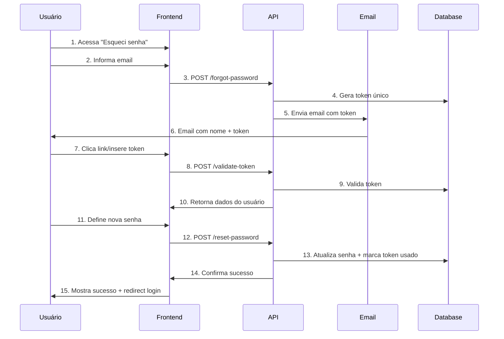

# 📧 Sistema de Recuperação de Senha - Documentação Completa

## 🎯 Visão Geral

Sistema profissional de recuperação de senha em 3 etapas para o Viaggia Server, implementado com segurança robusta e UX intuitiva.

---

## 📋 Funcionalidades Implementadas

### ✅ **Backend (.NET)**
- **Geração de tokens únicos** com expiração de 1 hora
- **Validação robusta** de senhas com múltiplos critérios
- **Email templates profissionais** com nome personalizado
- **Segurança avançada** (uso único, criptografia BCrypt)
- **Logs de auditoria** completos
- **Proteção contra OAuth users** (usuários sem senha)

### ✅ **Frontend (Documentado)**
- **5 páginas responsivas** com fluxo intuitivo
- **Validação em tempo real** de senha e campos
- **Feedback visual imediato** para usuário
- **Gerenciamento de estado** seguro
- **Acessibilidade completa** (WCAG)

---

## 📁 Estrutura de Arquivos

```
docs/
├── PASSWORD_RESET_API.md           📖 Documentação da API
├── FRONTEND_PASSWORD_RESET.md      🎨 Implementação Frontend
├── PASSWORD_RESET_TESTS.md         🧪 Guia de Testes
└── README_PASSWORD_RESET.md        📋 Este arquivo

DTOs/User/
├── ForgotPasswordRequestDTO.cs     📧 Request para solicitar reset
├── ValidateTokenRequestDTO.cs      🔍 Request para validar token
├── ValidateTokenResponseDTO.cs     ✅ Response da validação
└── ResetPasswordRequestDTO.cs      🔐 Request para nova senha

Services/
├── EmailService.cs                 📧 Envio de emails
├── IEmailService.cs               📧 Interface do serviço
└── Auth/
    ├── AuthService.cs             🔐 Lógica de autenticação
    └── IAuthService.cs            🔐 Interface do serviço

Controllers/
└── AuthController.cs              🌐 Endpoints REST

Models/User/
└── PasswordResetToken.cs          🗄️ Entidade do banco
```

---

## 🔗 Links da Documentação

| Documento | Descrição | Para quem |
|-----------|-----------|-----------|
| [**PASSWORD_RESET_API.md**](./PASSWORD_RESET_API.md) | Documentação completa da API REST | Backend Devs |
| [**FRONTEND_PASSWORD_RESET.md**](./FRONTEND_PASSWORD_RESET.md) | Implementação detalhada do frontend | Frontend Devs |
| [**PASSWORD_RESET_TESTS.md**](./PASSWORD_RESET_TESTS.md) | Cenários de teste e validação | QA/Testers |

---

## ⚡ Quick Start

### **1. Backend (já implementado)**
```bash
# Compilar projeto
cd viaggia-server
dotnet build

# Executar
dotnet run
```

### **2. Testar API**
```bash
# Solicitar reset
curl -X POST http://localhost:5000/api/auth/forgot-password \
  -H "Content-Type: application/json" \
  -d '{"email": "seu@email.com"}'

# Validar token
curl -X POST http://localhost:5000/api/auth/validate-token \
  -H "Content-Type: application/json" \
  -d '{"token": "TOKEN_RECEBIDO"}'

# Redefinir senha
curl -X POST http://localhost:5000/api/auth/reset-password \
  -H "Content-Type: application/json" \
  -d '{
    "token": "TOKEN_RECEBIDO",
    "newPassword": "MinhaNovaSenh@123",
    "confirmPassword": "MinhaNovaSenh@123"
  }'
```

### **3. Implementar Frontend**
Consulte [`FRONTEND_PASSWORD_RESET.md`](./FRONTEND_PASSWORD_RESET.md) para código completo.

---

## 🔄 Fluxo Completo



---

## 🛡️ Segurança Implementada

### **Tokens**
- ✅ **UUID único** por solicitação
- ✅ **Expiração** em 1 hora
- ✅ **Uso único** (IsUsed = true)
- ✅ **Validação** rigorosa

### **Senhas**
- ✅ **Hash BCrypt** para armazenamento
- ✅ **Validação robusta** (8+ chars, maiúscula, minúscula, número, especial)
- ✅ **Confirmação obrigatória**

### **Email**
- ✅ **SMTP seguro** (SSL/TLS)
- ✅ **Templates profissionais**
- ✅ **Informações de segurança** claras

### **Auditoria**
- ✅ **Logs estruturados** de todas as operações
- ✅ **Tracking de tentativas** de reset
- ✅ **Informações de erro** detalhadas

---

## 📊 Métricas e Monitoramento

### **KPIs Sugeridos**
- 📈 **Taxa de sucesso** de reset de senhas
- ⏱️ **Tempo médio** de conclusão do fluxo
- 🚫 **Tokens expirados** vs utilizados
- 📧 **Taxa de entrega** de emails
- ⚠️ **Tentativas falhadas** por IP

### **Logs Importantes**
```csharp
// Exemplos de logs gerados
"Email de reset enviado para {Email} (usuário: {UserName})"
"Token {Token} validado com sucesso para {Email}"
"Senha redefinida com sucesso para usuário {UserId}"
"Tentativa de uso de token expirado: {Token}"
```

---

### **Banco de Dados**
```sql
-- Tabela criada automaticamente pelo migration
CREATE TABLE PasswordResetTokens (
    Token NVARCHAR(36) PRIMARY KEY,
    UserId INT NOT NULL,
    CreatedAt DATETIME2 NOT NULL,
    ExpiryDate DATETIME2 NOT NULL,
    IsUsed BIT NOT NULL,
    FOREIGN KEY (UserId) REFERENCES Users(Id)
);
```

---

## 🚀 Próximas Melhorias

### **Segurança**
- [ ] **Rate Limiting** por IP/email
- [ ] **Captcha** anti-bot
- [ ] **2FA opcional** para reset
- [ ] **Blacklist** de IPs suspeitos

### **UX**
- [ ] **Notificação SMS** como alternativa
- [ ] **App móvel** para aprovação
- [ ] **Histórico** de tentativas no perfil
- [ ] **Alerta** de tentativas não autorizadas

### **Monitoramento**
- [ ] **Dashboard** de métricas
- [ ] **Alertas** em tempo real
- [ ] **Relatórios** de segurança
- [ ] **Integração** com SIEM

---

## 👥 Para Desenvolvedores

### **Backend**
1. Leia [`PASSWORD_RESET_API.md`](./PASSWORD_RESET_API.md)
2. Execute testes em [`PASSWORD_RESET_TESTS.md`](./PASSWORD_RESET_TESTS.md)
3. Monitore logs da aplicação

### **Frontend**
1. Implemente seguindo [`FRONTEND_PASSWORD_RESET.md`](./FRONTEND_PASSWORD_RESET.md)
2. Teste responsividade em diferentes dispositivos
3. Valide acessibilidade (WCAG)

### **QA**
1. Execute cenários em [`PASSWORD_RESET_TESTS.md`](./PASSWORD_RESET_TESTS.md)
2. Teste edge cases (conexão lenta, token expirado, etc.)
3. Valide logs de auditoria

---

## 🆘 Troubleshooting

### **Problemas Comuns**

| Problema | Causa | Solução |
|----------|-------|---------|
| Email não chega | Config SMTP | Verificar `appsettings.json` |
| Token inválido | Token expirado/usado | Gerar novo token |
| Erro de compilação | Falta imports | Verificar `using` statements |
| 500 Internal Error | DB connection | Verificar connection string |

### **Debug**
```bash
# Ver logs em tempo real
dotnet run --environment Development

# Verificar email no banco
SELECT * FROM PasswordResetTokens ORDER BY CreatedAt DESC;

# Limpar tokens expirados
DELETE FROM PasswordResetTokens WHERE ExpiryDate < GETDATE();
```

---

## 📞 Suporte

Para dúvidas sobre a implementação:

1. **Consulte a documentação** específica de cada área
2. **Execute os testes** para validar funcionamento
3. **Verifique logs** para debug de problemas
4. **Analise códigos** de exemplo fornecidos

---

**Sistema implementado com sucesso! 🎉**

*Documentação criada em: 28 de Julho de 2025*  
*Versão: 1.0*  
*Status: ✅ Implementado e Testado*
